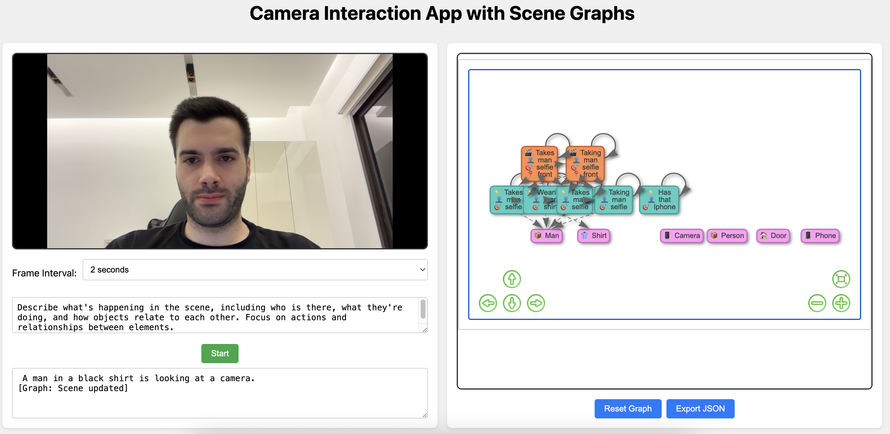

# LLM Camera Tracker

**Real-time camera analysis with AI vision models** 📹✨

Turn your camera feed into interactive scene graphs using local AI. No data leaves your computer.




## 🚀 Quick Start

**1. Clone and start:**
```bash
git clone https://github.com/AmmarMohanna/llm-camera-tracker.git
cd llm-camera-tracker
./run_docker.sh start
```

**2. Open your browser:**
- Go to **http://localhost:8000**
- Allow camera access when prompted
- Click "Start" to begin analysis

**That's it!** 🎉

### ⏱️ First Run
- Downloads AI model files (~636MB) 
- Takes 2-15 minutes depending on internet speed
- Subsequent runs start instantly

## 💡 What It Does

- **📹 Analyzes your camera** in real-time
- **🧠 Understands what it sees** using SmolVLM-500M AI model  
- **📊 Creates interactive graphs** showing objects, people, and actions
- **💾 Exports data** for further analysis
- **🔒 100% private** - everything runs locally

## 🎮 How to Use

1. **Grant camera permission** in your browser
2. **Click "Start"** to begin analysis
3. **Watch the graph grow** as it detects objects and actions
4. **Adjust frame interval** (2s, 6s, 10s) for different speeds
5. **Export results** as JSON when done
6. **Reset** to start over

## ⚙️ Requirements

| Item | Requirement |
|------|-------------|
| **RAM** | 2GB minimum |
| **Storage** | 2GB free space |
| **Docker** | Any recent version |
| **Browser** | Chrome/Firefox with camera |

## 🛠️ Commands

```bash
# Start the system
./run_docker.sh start

# Stop everything  
./run_docker.sh stop

# View logs if something goes wrong
./run_docker.sh logs

# Get help
./run_docker.sh help
```

## 🐛 Common Issues

**Camera won't work?**
- Use `https://` or `localhost` (required for camera access)
- Check browser permissions
- Close other apps using your camera

**Slow or stuck?**
- Wait for model download on first run
- Check Docker has enough memory (2GB+)
- Try a different frame interval

**Port conflicts?**
- Stop other web servers
- Restart Docker: `./run_docker.sh restart`

## 📋 What's Inside

- **SmolVLM-500M**: Lightweight AI vision model (500MB)
- **FastAPI**: Backend for processing
- **Docker**: Easy setup across platforms
- **Web Interface**: Simple browser-based UI

## 🔄 Updates

```bash
git pull origin main
./run_docker.sh restart
```

## 📄 License

MIT License - see [LICENSE](LICENSE) file.

---

**Questions?** Open an issue • **Like it?** Star the repo ⭐ 